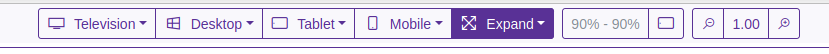
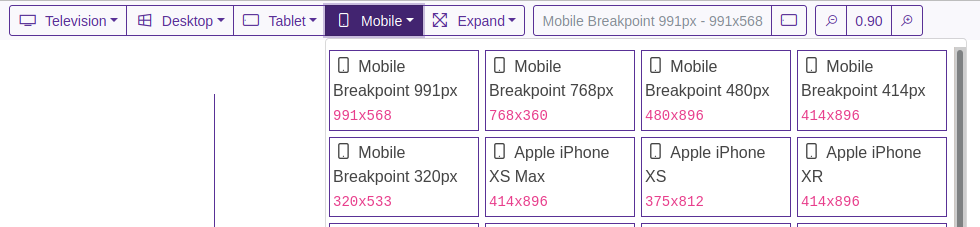
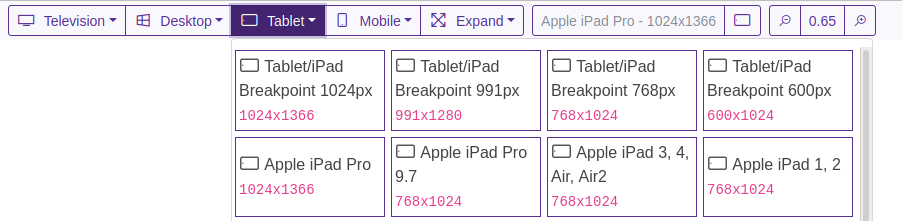
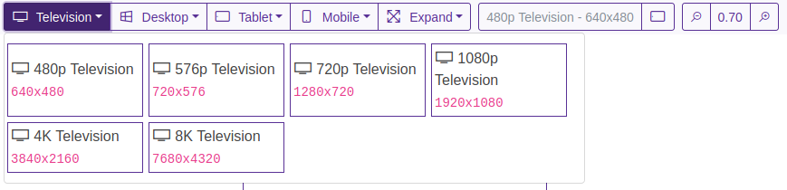
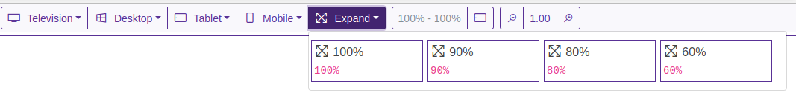
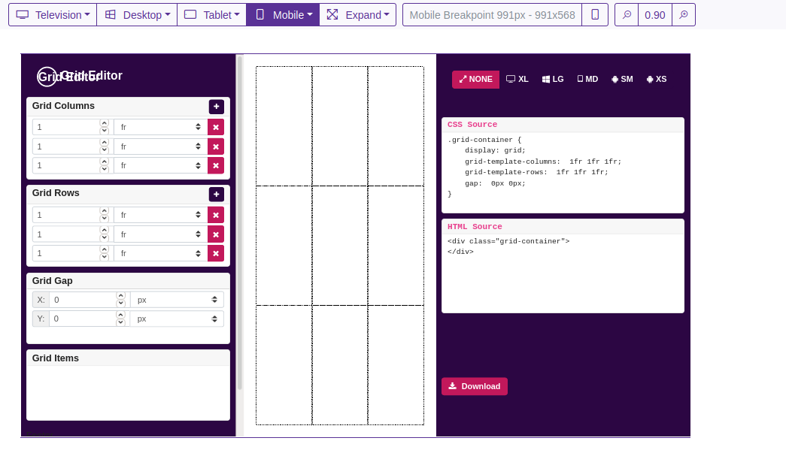

# React Device Responsive

Tools for check site or react components on Responsive Devices

## Toolbar

## Support Mobile

## Support Tablet

## Support Desktop

## Support TV

## Support Monitor

## Demo

# Yracnet React App Template

> Made with cra-template-yracnet template

This project was bootstrapped with [Yracnet React App Template](https://github.com/yracnet/cra-template-yracnet).

## Available Modules

This project has configuration:

- node-sass
- bootstrap
- font-awesome

## Directory

- */src/main* directory is for pages navegation

- */src/_* directory is for helpers, hooks, custom components, rest services 

## Configuration

This project use the jsconfig.json for declare src as root imports

## Favicon

Generate your favicon on https://favicon.io/favicon-generator/ and change to */src/public/_/*
